# Key Objects

[_Documentation generated by Documatic_](https://www.documatic.com)

<!---Documatic-section-utils.ot2bieos_ts_batch-start--->
## utils.ot2bieos_ts_batch

<!---Documatic-section-ot2bieos_ts_batch-start--->
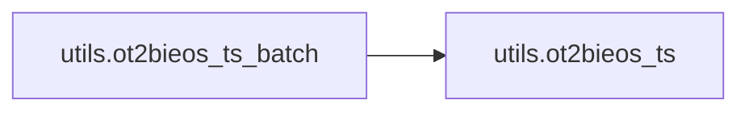

### Object Calls

* utils.ot2bieos_ts

<!---Documatic-block-utils.ot2bieos_ts_batch-start--->
<details>
	<summary><code>utils.ot2bieos_ts_batch</code> code snippet</summary>

```python
def ot2bieos_ts_batch(ts_tag_seqs):
    new_ts_tag_seqs = []
    n_seqs = len(ts_tag_seqs)
    for i in range(n_seqs):
        new_ts_seq = ot2bieos_ts(ts_tag_sequence=ts_tag_seqs[i])
        new_ts_tag_seqs.append(new_ts_seq)
    return new_ts_tag_seqs
```
</details>
<!---Documatic-block-utils.ot2bieos_ts_batch-end--->
<!---Documatic-section-ot2bieos_ts_batch-end--->

# #
<!---Documatic-section-utils.ot2bieos_ts_batch-end--->

<!---Documatic-section-utils.bio2ot_ote_batch-start--->
## utils.bio2ot_ote_batch

<!---Documatic-section-bio2ot_ote_batch-start--->
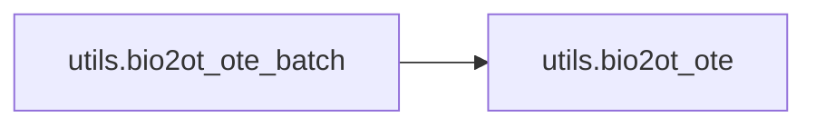

### Object Calls

* utils.bio2ot_ote

<!---Documatic-block-utils.bio2ot_ote_batch-start--->
<details>
	<summary><code>utils.bio2ot_ote_batch</code> code snippet</summary>

```python
def bio2ot_ote_batch(ote_tag_seqs):
    new_ote_tag_seqs = []
    n_seqs = len(ote_tag_seqs)
    for i in range(n_seqs):
        new_ote_seq = bio2ot_ote(ote_tag_sequence=ote_tag_seqs[i])
        new_ote_tag_seqs.append(new_ote_seq)
    return new_ote_tag_seqs
```
</details>
<!---Documatic-block-utils.bio2ot_ote_batch-end--->
<!---Documatic-section-bio2ot_ote_batch-end--->

# #
<!---Documatic-section-utils.bio2ot_ote_batch-end--->

<!---Documatic-section-utils.ot2bio_ote-start--->
## utils.ot2bio_ote

<!---Documatic-section-ot2bio_ote-start--->
<!---Documatic-block-utils.ot2bio_ote-start--->
<details>
	<summary><code>utils.ot2bio_ote</code> code snippet</summary>

```python
def ot2bio_ote(ote_tag_sequence):
    new_ote_sequence = []
    n_tag = len(ote_tag_sequence)
    prev_ote_tag = '$$$'
    for i in range(n_tag):
        cur_ote_tag = ote_tag_sequence[i]
        assert cur_ote_tag == 'O' or cur_ote_tag == 'T'
        if cur_ote_tag == 'O':
            new_ote_sequence.append(cur_ote_tag)
        elif prev_ote_tag == 'T':
            new_ote_sequence.append('I')
        else:
            new_ote_sequence.append('B')
        prev_ote_tag = cur_ote_tag
    return new_ote_sequence
```
</details>
<!---Documatic-block-utils.ot2bio_ote-end--->
<!---Documatic-section-ot2bio_ote-end--->

# #
<!---Documatic-section-utils.ot2bio_ote-end--->

<!---Documatic-section-utils.ot2bio_ts_batch-start--->
## utils.ot2bio_ts_batch

<!---Documatic-section-ot2bio_ts_batch-start--->
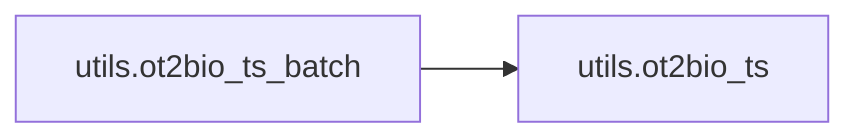

### Object Calls

* utils.ot2bio_ts

<!---Documatic-block-utils.ot2bio_ts_batch-start--->
<details>
	<summary><code>utils.ot2bio_ts_batch</code> code snippet</summary>

```python
def ot2bio_ts_batch(ts_tag_seqs):
    new_ts_tag_seqs = []
    n_seqs = len(ts_tag_seqs)
    for i in range(n_seqs):
        new_ts_seq = ot2bio_ts(ts_tag_sequence=ts_tag_seqs[i])
        new_ts_tag_seqs.append(new_ts_seq)
    return new_ts_tag_seqs
```
</details>
<!---Documatic-block-utils.ot2bio_ts_batch-end--->
<!---Documatic-section-ot2bio_ts_batch-end--->

# #
<!---Documatic-section-utils.ot2bio_ts_batch-end--->

<!---Documatic-section-utils.ot2bieos-start--->
## utils.ot2bieos

<!---Documatic-section-ot2bieos-start--->
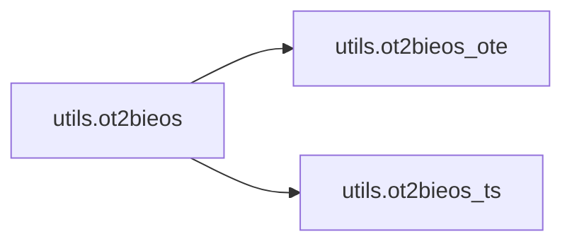

### Object Calls

* utils.ot2bieos_ote
* utils.ot2bieos_ts

<!---Documatic-block-utils.ot2bieos-start--->
<details>
	<summary><code>utils.ot2bieos</code> code snippet</summary>

```python
def ot2bieos(ote_tag_sequence, ts_tag_sequence):
    new_ote_sequence = ot2bieos_ote(ote_tag_sequence=ote_tag_sequence)
    new_ts_sequence = ot2bieos_ts(ts_tag_sequence=ts_tag_sequence)
    assert len(ote_tag_sequence) == len(new_ote_sequence)
    assert len(ts_tag_sequence) == len(new_ts_sequence)
    return (new_ote_sequence, new_ts_sequence)
```
</details>
<!---Documatic-block-utils.ot2bieos-end--->
<!---Documatic-section-ot2bieos-end--->

# #
<!---Documatic-section-utils.ot2bieos-end--->

<!---Documatic-section-utils.bio2ot-start--->
## utils.bio2ot

<!---Documatic-section-bio2ot-start--->
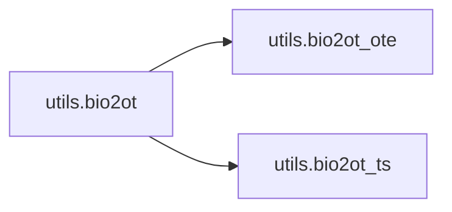

### Object Calls

* utils.bio2ot_ote
* utils.bio2ot_ts

<!---Documatic-block-utils.bio2ot-start--->
<details>
	<summary><code>utils.bio2ot</code> code snippet</summary>

```python
def bio2ot(ote_tag_sequence, ts_tag_sequence):
    assert len(ote_tag_sequence) == len(ts_tag_sequence)
    new_ote_sequence = bio2ot_ote(ote_tag_sequence=ote_tag_sequence)
    new_ts_sequence = bio2ot_ts(ts_tag_sequence=ts_tag_sequence)
    assert len(new_ote_sequence) == len(ote_tag_sequence)
    assert len(new_ts_sequence) == len(ts_tag_sequence)
    return (new_ote_sequence, new_ts_sequence)
```
</details>
<!---Documatic-block-utils.bio2ot-end--->
<!---Documatic-section-bio2ot-end--->

# #
<!---Documatic-section-utils.bio2ot-end--->

<!---Documatic-section-utils.ot2bieos_batch-start--->
## utils.ot2bieos_batch

<!---Documatic-section-ot2bieos_batch-start--->
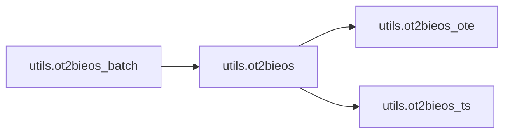

### Object Calls

* utils.ot2bieos

<!---Documatic-block-utils.ot2bieos_batch-start--->
<details>
	<summary><code>utils.ot2bieos_batch</code> code snippet</summary>

```python
def ot2bieos_batch(ote_tags, ts_tags):
    (new_ote_tags, new_ts_tags) = ([], [])
    assert len(ote_tags) == len(ts_tags)
    n_seqs = len(ote_tags)
    for i in range(n_seqs):
        (ote, ts) = ot2bieos(ote_tag_sequence=ote_tags[i], ts_tag_sequence=ts_tags[i])
        new_ote_tags.append(ote)
        new_ts_tags.append(ts)
    return (new_ote_tags, new_ts_tags)
```
</details>
<!---Documatic-block-utils.ot2bieos_batch-end--->
<!---Documatic-section-ot2bieos_batch-end--->

# #
<!---Documatic-section-utils.ot2bieos_batch-end--->

<!---Documatic-section-utils.bio2ot_ts-start--->
## utils.bio2ot_ts

<!---Documatic-section-bio2ot_ts-start--->
<!---Documatic-block-utils.bio2ot_ts-start--->
<details>
	<summary><code>utils.bio2ot_ts</code> code snippet</summary>

```python
def bio2ot_ts(ts_tag_sequence):
    new_ts_sequence = []
    n_tags = len(ts_tag_sequence)
    for i in range(n_tags):
        ts_tag = ts_tag_sequence[i]
        if ts_tag == 'O':
            new_ts_sequence.append('O')
        else:
            (pos, sentiment) = ts_tag.split('-')
            new_ts_sequence.append('T-%s' % sentiment)
    return new_ts_sequence
```
</details>
<!---Documatic-block-utils.bio2ot_ts-end--->
<!---Documatic-section-bio2ot_ts-end--->

# #
<!---Documatic-section-utils.bio2ot_ts-end--->

<!---Documatic-section-utils.build_dataset-start--->
## utils.build_dataset

<!---Documatic-section-build_dataset-start--->
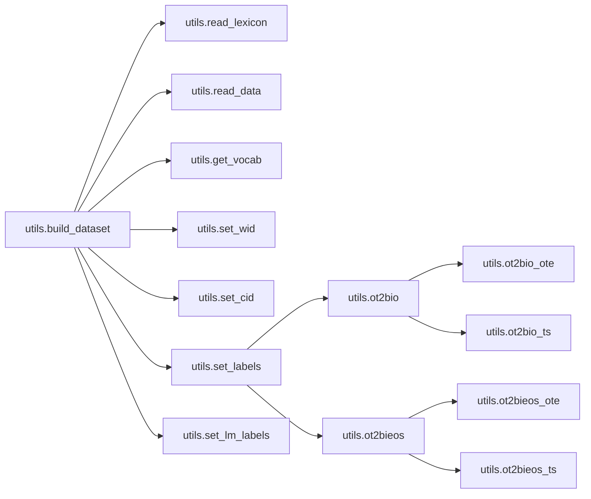

### Object Calls

* utils.read_lexicon
* utils.read_data
* utils.get_vocab
* utils.set_wid
* utils.set_cid
* utils.set_labels
* utils.set_lm_labels

<!---Documatic-block-utils.build_dataset-start--->
<details>
	<summary><code>utils.build_dataset</code> code snippet</summary>

```python
def build_dataset(ds_name, input_win=1, tagging_schema='BIO', stm_win=1):
    stm_lex = read_lexicon()
    train_path = './data/%s_train.txt' % ds_name
    test_path = './data/%s_test.txt' % ds_name
    train_set = read_data(path=train_path)
    test_set = read_data(path=test_path)
    (vocab, char_vocab) = get_vocab(train_set=train_set, test_set=test_set)
    train_set = set_wid(dataset=train_set, vocab=vocab, win=input_win)
    test_set = set_wid(dataset=test_set, vocab=vocab, win=input_win)
    train_set = set_cid(dataset=train_set, char_vocab=char_vocab)
    test_set = set_cid(dataset=test_set, char_vocab=char_vocab)
    (train_set, ote_tag_vocab, ts_tag_vocab) = set_labels(dataset=train_set, tagging_schema=tagging_schema)
    (test_set, _, _) = set_labels(dataset=test_set, tagging_schema=tagging_schema)
    train_set = set_lm_labels(dataset=train_set, vocab=vocab, stm_lex=stm_lex, stm_win=stm_win)
    test_set = set_lm_labels(dataset=test_set, vocab=vocab, stm_lex=stm_lex, stm_win=stm_win)
    n_train = len(train_set)
    n_val = int(n_train * 0.1)
    val_sample_ids = np.random.choice(n_train, n_val, replace=False)
    print('The first 15 validation samples:', val_sample_ids[:15])
    (val_set, tmp_train_set) = ([], [])
    for i in range(n_train):
        record = train_set[i]
        if i in val_sample_ids:
            val_set.append(record)
        else:
            tmp_train_set.append(record)
    train_set = [r for r in tmp_train_set]
    return (train_set, val_set, test_set, vocab, char_vocab, ote_tag_vocab, ts_tag_vocab)
```
</details>
<!---Documatic-block-utils.build_dataset-end--->
<!---Documatic-section-build_dataset-end--->

# #
<!---Documatic-section-utils.build_dataset-end--->

<!---Documatic-section-utils.set_cid-start--->
## utils.set_cid

<!---Documatic-section-set_cid-start--->
<!---Documatic-block-utils.set_cid-start--->
<details>
	<summary><code>utils.set_cid</code> code snippet</summary>

```python
def set_cid(dataset, char_vocab):
    n_records = len(dataset)
    cids = []
    for i in range(n_records):
        words = dataset[i]['words']
        cids = []
        for w in words:
            cids.append([char_vocab[ch] for ch in list(w)])
        dataset[i]['cids'] = cids.copy()
    return dataset
```
</details>
<!---Documatic-block-utils.set_cid-end--->
<!---Documatic-section-set_cid-end--->

# #
<!---Documatic-section-utils.set_cid-end--->

<!---Documatic-section-utils.ot2bio_ts-start--->
## utils.ot2bio_ts

<!---Documatic-section-ot2bio_ts-start--->
<!---Documatic-block-utils.ot2bio_ts-start--->
<details>
	<summary><code>utils.ot2bio_ts</code> code snippet</summary>

```python
def ot2bio_ts(ts_tag_sequence):
    new_ts_sequence = []
    n_tag = len(ts_tag_sequence)
    prev_pos = '$$$'
    for i in range(n_tag):
        cur_ts_tag = ts_tag_sequence[i]
        if cur_ts_tag == 'O':
            new_ts_sequence.append('O')
            cur_pos = 'O'
        else:
            (cur_pos, cur_sentiment) = cur_ts_tag.split('-')
            if cur_pos == prev_pos:
                new_ts_sequence.append('I-%s' % cur_sentiment)
            else:
                new_ts_sequence.append('B-%s' % cur_sentiment)
        prev_pos = cur_pos
    return new_ts_sequence
```
</details>
<!---Documatic-block-utils.ot2bio_ts-end--->
<!---Documatic-section-ot2bio_ts-end--->

# #
<!---Documatic-section-utils.ot2bio_ts-end--->

<!---Documatic-section-utils.bio2ot_ote-start--->
## utils.bio2ot_ote

<!---Documatic-section-bio2ot_ote-start--->
<!---Documatic-block-utils.bio2ot_ote-start--->
<details>
	<summary><code>utils.bio2ot_ote</code> code snippet</summary>

```python
def bio2ot_ote(ote_tag_sequence):
    new_ote_sequence = []
    n_tags = len(ote_tag_sequence)
    for i in range(n_tags):
        ote_tag = ote_tag_sequence[i]
        if ote_tag == 'B' or ote_tag == 'I':
            new_ote_sequence.append('T')
        else:
            new_ote_sequence.append('I')
    return new_ote_sequence
```
</details>
<!---Documatic-block-utils.bio2ot_ote-end--->
<!---Documatic-section-bio2ot_ote-end--->

# #
<!---Documatic-section-utils.bio2ot_ote-end--->

<!---Documatic-section-utils.get_vocab-start--->
## utils.get_vocab

<!---Documatic-section-get_vocab-start--->
<!---Documatic-block-utils.get_vocab-start--->
<details>
	<summary><code>utils.get_vocab</code> code snippet</summary>

```python
def get_vocab(train_set, test_set):
    vocab = {'PUNCT': 0, 'PADDING': 1}
    inv_vocab = {0: 'PUNCT', 1: 'PADDING'}
    wid = 2
    for record in train_set + test_set:
        assert 'words' in record
        words = record['words']
        for w in words:
            if w not in vocab:
                vocab[w] = wid
                inv_vocab[wid] = w
                wid += 1
    print('Find %s different words in the dataset' % len(vocab))
    char_string = ''
    for w in vocab:
        char_string += w
    chars = list(set(char_string))
    (cid, char_vocab) = (0, {})
    for ch in chars:
        if ch not in char_vocab:
            char_vocab[ch] = cid
            cid += 1
    print('Find %s different chars in the dataset' % len(char_vocab))
    return (vocab, char_vocab)
```
</details>
<!---Documatic-block-utils.get_vocab-end--->
<!---Documatic-section-get_vocab-end--->

# #
<!---Documatic-section-utils.get_vocab-end--->

<!---Documatic-section-utils.ot2bieos_ote_batch-start--->
## utils.ot2bieos_ote_batch

<!---Documatic-section-ot2bieos_ote_batch-start--->
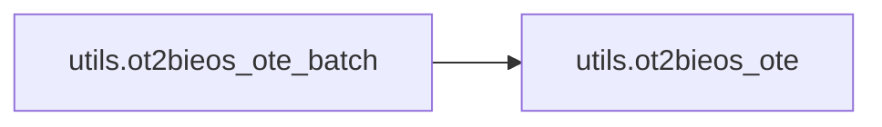

### Object Calls

* utils.ot2bieos_ote

<!---Documatic-block-utils.ot2bieos_ote_batch-start--->
<details>
	<summary><code>utils.ot2bieos_ote_batch</code> code snippet</summary>

```python
def ot2bieos_ote_batch(ote_tag_seqs):
    new_ote_tag_seqs = []
    n_seqs = len(ote_tag_seqs)
    for i in range(n_seqs):
        new_ote_seq = ot2bieos_ote(ote_tag_sequence=ote_tag_seqs[i])
        new_ote_tag_seqs.append(new_ote_seq)
    return new_ote_tag_seqs
```
</details>
<!---Documatic-block-utils.ot2bieos_ote_batch-end--->
<!---Documatic-section-ot2bieos_ote_batch-end--->

# #
<!---Documatic-section-utils.ot2bieos_ote_batch-end--->

<!---Documatic-section-utils.set_labels-start--->
## utils.set_labels

<!---Documatic-section-set_labels-start--->
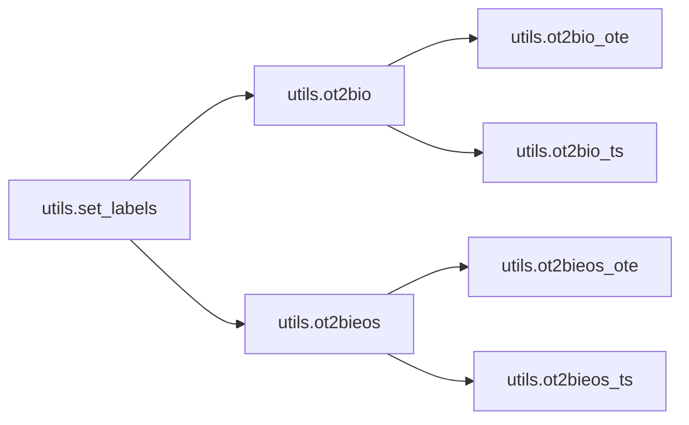

### Object Calls

* utils.ot2bio
* utils.ot2bieos

<!---Documatic-block-utils.set_labels-start--->
<details>
	<summary><code>utils.set_labels</code> code snippet</summary>

```python
def set_labels(dataset, tagging_schema='BIO'):
    if tagging_schema == 'OT':
        ote_tag_vocab = {'O': 0, 'T': 1}
        ts_tag_vocab = {'O': 0, 'T-POS': 1, 'T-NEG': 2, 'T-NEU': 3}
    elif tagging_schema == 'BIO':
        ote_tag_vocab = {'O': 0, 'B': 1, 'I': 2}
        ts_tag_vocab = {'O': 0, 'B-POS': 1, 'I-POS': 2, 'B-NEG': 3, 'I-NEG': 4, 'B-NEU': 5, 'I-NEU': 6}
    elif tagging_schema == 'BIEOS':
        ote_tag_vocab = {'O': 0, 'B': 1, 'I': 2, 'E': 3, 'S': 4}
        ts_tag_vocab = {'O': 0, 'B-POS': 1, 'I-POS': 2, 'E-POS': 3, 'S-POS': 4, 'B-NEG': 5, 'I-NEG': 6, 'E-NEG': 7, 'S-NEG': 8, 'B-NEU': 9, 'I-NEU': 10, 'E-NEU': 11, 'S-NEU': 12}
    else:
        raise Exception('Invalid tagging schema %s' % tagging_schema)
    n_records = len(dataset)
    for i in range(n_records):
        ote_tags = dataset[i]['ote_raw_tags']
        ts_tags = dataset[i]['ts_raw_tags']
        if tagging_schema == 'OT':
            pass
        elif tagging_schema == 'BIO':
            (ote_tags, ts_tags) = ot2bio(ote_tag_sequence=ote_tags, ts_tag_sequence=ts_tags)
        elif tagging_schema == 'BIEOS':
            (ote_tags, ts_tags) = ot2bieos(ote_tag_sequence=ote_tags, ts_tag_sequence=ts_tags)
        else:
            raise Exception('Invalid tagging schema %s' % tagging_schema)
        ote_labels = [ote_tag_vocab[t] for t in ote_tags]
        ts_labels = [ts_tag_vocab[t] for t in ts_tags]
        dataset[i]['ote_tags'] = ote_tags.copy()
        dataset[i]['ts_tags'] = ts_tags.copy()
        dataset[i]['ote_labels'] = ote_labels.copy()
        dataset[i]['ts_labels'] = ts_labels.copy()
    return (dataset, ote_tag_vocab, ts_tag_vocab)
```
</details>
<!---Documatic-block-utils.set_labels-end--->
<!---Documatic-section-set_labels-end--->

# #
<!---Documatic-section-utils.set_labels-end--->

<!---Documatic-section-utils.bio2ot_ts_batch-start--->
## utils.bio2ot_ts_batch

<!---Documatic-section-bio2ot_ts_batch-start--->
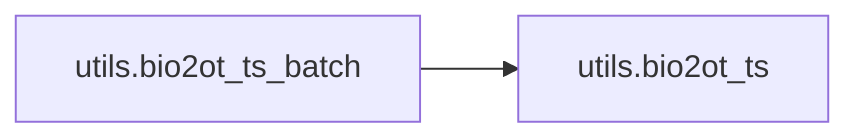

### Object Calls

* utils.bio2ot_ts

<!---Documatic-block-utils.bio2ot_ts_batch-start--->
<details>
	<summary><code>utils.bio2ot_ts_batch</code> code snippet</summary>

```python
def bio2ot_ts_batch(ts_tag_seqs):
    new_ts_tag_seqs = []
    n_seqs = len(ts_tag_seqs)
    for i in range(n_seqs):
        new_ts_seq = bio2ot_ts(ts_tag_sequence=ts_tag_seqs[i])
        new_ts_tag_seqs.append(new_ts_seq)
    return new_ts_tag_seqs
```
</details>
<!---Documatic-block-utils.bio2ot_ts_batch-end--->
<!---Documatic-section-bio2ot_ts_batch-end--->

# #
<!---Documatic-section-utils.bio2ot_ts_batch-end--->

<!---Documatic-section-utils.set_wid-start--->
## utils.set_wid

<!---Documatic-section-set_wid-start--->
<!---Documatic-block-utils.set_wid-start--->
<details>
	<summary><code>utils.set_wid</code> code snippet</summary>

```python
def set_wid(dataset, vocab, win=1):
    n_records = len(dataset)
    for i in range(n_records):
        words = dataset[i]['words']
        lm_labels = []
        for w in words:
            lm_labels.append(vocab[w])
        dataset[i]['lm_labels'] = lm_labels.copy()
        n_padded_words = win // 2
        pad_left = ['PADDING' for _ in range(n_padded_words)]
        pad_right = ['PADDING' for _ in range(n_padded_words)]
        padded_words = pad_left + words + pad_right
        win_input = list(ngrams(padded_words, win))
        assert len(win_input) == len(words)
        n_grams = []
        for t in win_input:
            n_grams.append(t)
        wids = [[vocab[w] for w in ngram] for ngram in n_grams]
        dataset[i]['wids'] = wids.copy()
    return dataset
```
</details>
<!---Documatic-block-utils.set_wid-end--->
<!---Documatic-section-set_wid-end--->

# #
<!---Documatic-section-utils.set_wid-end--->

<!---Documatic-section-utils.label2tag-start--->
## utils.label2tag

<!---Documatic-section-label2tag-start--->
<!---Documatic-block-utils.label2tag-start--->
<details>
	<summary><code>utils.label2tag</code> code snippet</summary>

```python
def label2tag(label_sequence, tag_vocab):
    inv_tag_vocab = {}
    for tag in tag_vocab:
        label = tag_vocab[tag]
        inv_tag_vocab[label] = tag
    tag_sequence = []
    n_tag = len(tag_vocab)
    for l in label_sequence:
        if l in inv_tag_vocab:
            tag_sequence.append(inv_tag_vocab[l])
        elif l == n_tag or l == n_tag + 1:
            tag_sequence.append('O')
        else:
            raise Exception('Invalid label %s' % l)
    return tag_sequence
```
</details>
<!---Documatic-block-utils.label2tag-end--->
<!---Documatic-section-label2tag-end--->

# #
<!---Documatic-section-utils.label2tag-end--->

<!---Documatic-section-utils.read_data-start--->
## utils.read_data

<!---Documatic-section-read_data-start--->
<!---Documatic-block-utils.read_data-start--->
<details>
	<summary><code>utils.read_data</code> code snippet</summary>

```python
def read_data(path):
    dataset = []
    with open(path, encoding='UTF-8') as fp:
        for line in fp:
            record = {}
            (sent, tag_string) = line.strip().split('####')
            record['sentence'] = sent
            word_tag_pairs = tag_string.split(' ')
            ts_tags = []
            ote_tags = []
            words = []
            for item in word_tag_pairs:
                eles = item.split('=')
                if len(eles) == 2:
                    (word, tag) = eles
                elif len(eles) > 2:
                    tag = eles[-1]
                    word = (len(eles) - 2) * '='
                if word not in string.punctuation:
                    words.append(word.lower())
                else:
                    words.append('PUNCT')
                if tag == 'O':
                    ote_tags.append('O')
                    ts_tags.append('O')
                elif tag == 'T-POS':
                    ote_tags.append('T')
                    ts_tags.append('T-POS')
                elif tag == 'T-NEG':
                    ote_tags.append('T')
                    ts_tags.append('T-NEG')
                elif tag == 'T-NEU':
                    ote_tags.append('T')
                    ts_tags.append('T-NEU')
                else:
                    raise Exception('Invalid tag %s!!!' % tag)
            record['words'] = words.copy()
            record['ote_raw_tags'] = ote_tags.copy()
            record['ts_raw_tags'] = ts_tags.copy()
            dataset.append(record)
    print('Obtain %s records from %s' % (len(dataset), path))
    return dataset
```
</details>
<!---Documatic-block-utils.read_data-end--->
<!---Documatic-section-read_data-end--->

# #
<!---Documatic-section-utils.read_data-end--->

<!---Documatic-section-utils.ot2bieos_ote-start--->
## utils.ot2bieos_ote

<!---Documatic-section-ot2bieos_ote-start--->
<!---Documatic-block-utils.ot2bieos_ote-start--->
<details>
	<summary><code>utils.ot2bieos_ote</code> code snippet</summary>

```python
def ot2bieos_ote(ote_tag_sequence):
    n_tags = len(ote_tag_sequence)
    new_ote_sequence = []
    prev_ote_tag = '$$$'
    for i in range(n_tags):
        cur_ote_tag = ote_tag_sequence[i]
        if cur_ote_tag == 'O':
            new_ote_sequence.append('O')
        elif prev_ote_tag != cur_ote_tag:
            if i == n_tags - 1:
                new_ote_sequence.append('S')
            elif ote_tag_sequence[i + 1] == cur_ote_tag:
                new_ote_sequence.append('B')
            elif ote_tag_sequence[i + 1] != cur_ote_tag:
                new_ote_sequence.append('S')
            else:
                raise Exception('Invalid ner tag value: %s' % cur_ote_tag)
        elif i == n_tags - 1:
            new_ote_sequence.append('E')
        elif ote_tag_sequence[i + 1] == cur_ote_tag:
            new_ote_sequence.append('I')
        elif ote_tag_sequence[i + 1] != cur_ote_tag:
            new_ote_sequence.append('E')
        else:
            raise Exception('Invalid ner tag value: %s' % cur_ote_tag)
        prev_ote_tag = cur_ote_tag
    return new_ote_sequence
```
</details>
<!---Documatic-block-utils.ot2bieos_ote-end--->
<!---Documatic-section-ot2bieos_ote-end--->

# #
<!---Documatic-section-utils.ot2bieos_ote-end--->

<!---Documatic-section-utils.load_char_embeddings-start--->
## utils.load_char_embeddings

<!---Documatic-section-load_char_embeddings-start--->
<!---Documatic-block-utils.load_char_embeddings-start--->
<details>
	<summary><code>utils.load_char_embeddings</code> code snippet</summary>

```python
def load_char_embeddings(char_vocab, ds_name):
    n_char = len(char_vocab)
    pkl = './embeddings/%s_char.pkl' % ds_name
    if os.path.exists(pkl):
        print('Load character embeddings from %s...' % pkl)
        embeddings = pickle.load(open(pkl, 'rb'))
    else:
        emb_path = './embeddings/char-embeddings.txt'
        print('Load character embeddings from %s...' % emb_path)
        raw_embeddings = {}
        n_found = 0
        with open(emb_path) as fp:
            for line in fp:
                eles = line.strip().split()
                ch = eles[0]
                vec = [float(ele) for ele in eles[1:]]
                if ch not in raw_embeddings:
                    raw_embeddings[ch] = vec
        dim_ch = len(raw_embeddings['A'])
        embeddings = np.zeros(shape=(n_char, dim_ch))
        for ch in char_vocab:
            cid = char_vocab[ch]
            if ch in raw_embeddings:
                embeddings[cid] = np.array(raw_embeddings[ch])
                n_found += 1
            else:
                embeddings[cid] = np.random.uniform(-0.25, 0.25, dim_ch)
        print('Find %s chars in pre-trained character embeddings...' % n_found)
        embeddings = np.array(embeddings, dtype='float32')
        pickle.dump(embeddings, open(pkl, 'wb'))
    return embeddings
```
</details>
<!---Documatic-block-utils.load_char_embeddings-end--->
<!---Documatic-section-load_char_embeddings-end--->

# #
<!---Documatic-section-utils.load_char_embeddings-end--->

<!---Documatic-section-utils.ot2bieos_ts-start--->
## utils.ot2bieos_ts

<!---Documatic-section-ot2bieos_ts-start--->
<!---Documatic-block-utils.ot2bieos_ts-start--->
<details>
	<summary><code>utils.ot2bieos_ts</code> code snippet</summary>

```python
def ot2bieos_ts(ts_tag_sequence):
    n_tags = len(ts_tag_sequence)
    new_ts_sequence = []
    prev_pos = '$$$'
    for i in range(n_tags):
        cur_ts_tag = ts_tag_sequence[i]
        if cur_ts_tag == 'O':
            new_ts_sequence.append('O')
            cur_pos = 'O'
        else:
            (cur_pos, cur_sentiment) = cur_ts_tag.split('-')
            if cur_pos != prev_pos:
                if i == n_tags - 1:
                    new_ts_sequence.append('S-%s' % cur_sentiment)
                else:
                    next_ts_tag = ts_tag_sequence[i + 1]
                    if next_ts_tag == 'O':
                        new_ts_sequence.append('S-%s' % cur_sentiment)
                    else:
                        new_ts_sequence.append('B-%s' % cur_sentiment)
            elif i == n_tags - 1:
                new_ts_sequence.append('E-%s' % cur_sentiment)
            else:
                next_ts_tag = ts_tag_sequence[i + 1]
                if next_ts_tag == 'O':
                    new_ts_sequence.append('E-%s' % cur_sentiment)
                else:
                    new_ts_sequence.append('I-%s' % cur_sentiment)
        prev_pos = cur_pos
    return new_ts_sequence
```
</details>
<!---Documatic-block-utils.ot2bieos_ts-end--->
<!---Documatic-section-ot2bieos_ts-end--->

# #
<!---Documatic-section-utils.ot2bieos_ts-end--->

<!---Documatic-section-utils.load_embeddings-start--->
## utils.load_embeddings

<!---Documatic-section-load_embeddings-start--->
<!---Documatic-block-utils.load_embeddings-start--->
<details>
	<summary><code>utils.load_embeddings</code> code snippet</summary>

```python
def load_embeddings(path, vocab, ds_name, emb_name):
    pkl = './embeddings/%s_%s.pkl' % (ds_name, emb_name)
    if os.path.exists(pkl):
        print('Load embeddings from existing pkl file %s...' % pkl)
        embeddings = pickle.load(open(pkl, 'rb'))
    else:
        print('Load embedding from %s...' % path)
        raw_embeddings = {}
        with open(path) as fp:
            for line in fp:
                eles = line.strip().split(' ')
                word = eles[0]
                if word in vocab:
                    raw_embeddings[word] = eles[1:]
        dim_w = len(raw_embeddings['the'])
        n_words = len(vocab)
        embeddings = np.zeros(shape=(n_words, dim_w))
        for w in vocab:
            wid = vocab[w]
            if w in raw_embeddings:
                embeddings[wid] = np.array([float(ele) for ele in raw_embeddings[w]])
            else:
                embeddings[wid] = np.random.uniform(-0.25, 0.25, dim_w)
        print('Find %s word embeddings...' % len(embeddings))
        if not os.path.exists('./embeddings'):
            os.mkdir('./embeddings')
        emb_path = './embeddings/%s_%s.pkl' % (ds_name, emb_name)
        pickle.dump(embeddings, open(emb_path, 'wb'))
    embeddings = np.array(embeddings, dtype='float32')
    return embeddings
```
</details>
<!---Documatic-block-utils.load_embeddings-end--->
<!---Documatic-section-load_embeddings-end--->

# #
<!---Documatic-section-utils.load_embeddings-end--->

<!---Documatic-section-utils.set_lm_labels-start--->
## utils.set_lm_labels

<!---Documatic-section-set_lm_labels-start--->
<!---Documatic-block-utils.set_lm_labels-start--->
<details>
	<summary><code>utils.set_lm_labels</code> code snippet</summary>

```python
def set_lm_labels(dataset, vocab, stm_lex, stm_win=3):
    n_records = len(dataset)
    for i in range(n_records):
        words = dataset[i]['words']
        (lm_labels_f, lm_labels_b) = ([], [])
        n_w = len(words)
        for j in range(n_w):
            if j == n_w - 1:
                next_word = 'PADDING'
            else:
                next_word = words[j + 1]
            lm_labels_f.append(vocab[next_word])
        for j in range(n_w - 1, -1, -1):
            if j == 0:
                next_word = 'PADDING'
            else:
                next_word = words[j - 1]
            lm_labels_b.append(vocab[next_word])
        dataset[i]['lm_labels_f'] = lm_labels_f.copy()
        dataset[i]['lm_labels_b'] = lm_labels_b.copy()
        stm_lm_labels = []
        for j in range(n_w):
            stm_ctx_lb = j - stm_win
            if stm_ctx_lb < 0:
                stm_ctx_lb = 0
            stm_ctx_rb = j + stm_win + 1
            left_ctx = words[stm_ctx_lb:j]
            right_ctx = words[j + 1:stm_ctx_rb]
            stm_ctx = left_ctx + right_ctx
            flag = False
            for w in stm_ctx:
                if w in stm_lex:
                    flag = True
                    break
            if flag:
                stm_lm_labels.append(1)
            else:
                stm_lm_labels.append(0)
        dataset[i]['stm_lm_labels'] = stm_lm_labels.copy()
    return dataset
```
</details>
<!---Documatic-block-utils.set_lm_labels-end--->
<!---Documatic-section-set_lm_labels-end--->

# #
<!---Documatic-section-utils.set_lm_labels-end--->

<!---Documatic-section-utils.ot2bio-start--->
## utils.ot2bio

<!---Documatic-section-ot2bio-start--->
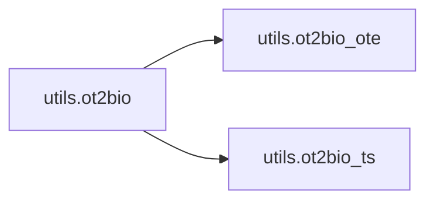

### Object Calls

* utils.ot2bio_ote
* utils.ot2bio_ts

<!---Documatic-block-utils.ot2bio-start--->
<details>
	<summary><code>utils.ot2bio</code> code snippet</summary>

```python
def ot2bio(ote_tag_sequence, ts_tag_sequence):
    new_ote_sequence = ot2bio_ote(ote_tag_sequence=ote_tag_sequence)
    new_ts_sequence = ot2bio_ts(ts_tag_sequence=ts_tag_sequence)
    assert len(new_ts_sequence) == len(ts_tag_sequence)
    assert len(new_ote_sequence) == len(ote_tag_sequence)
    return (new_ote_sequence, new_ts_sequence)
```
</details>
<!---Documatic-block-utils.ot2bio-end--->
<!---Documatic-section-ot2bio-end--->

# #
<!---Documatic-section-utils.ot2bio-end--->

<!---Documatic-section-utils.bieos2ot-start--->
## utils.bieos2ot

<!---Documatic-section-bieos2ot-start--->
<!---Documatic-block-utils.bieos2ot-start--->
<details>
	<summary><code>utils.bieos2ot</code> code snippet</summary>

```python
def bieos2ot(tag_sequence):
    new_sequence = []
    for t in tag_sequence:
        assert t == 'B' or t == 'I' or t == 'E' or (t == 'O') or (t == 'S')
        if t == 'O':
            new_sequence.append(t)
        else:
            new_sequence.append('T')
    assert len(new_sequence) == len(tag_sequence)
    return new_sequence
```
</details>
<!---Documatic-block-utils.bieos2ot-end--->
<!---Documatic-section-bieos2ot-end--->

# #
<!---Documatic-section-utils.bieos2ot-end--->

<!---Documatic-section-utils.ot2bio_ote_batch-start--->
## utils.ot2bio_ote_batch

<!---Documatic-section-ot2bio_ote_batch-start--->
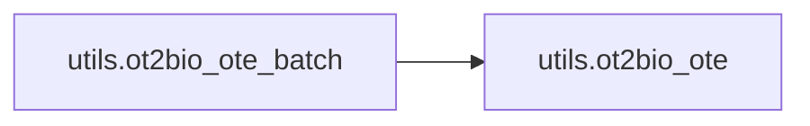

### Object Calls

* utils.ot2bio_ote

<!---Documatic-block-utils.ot2bio_ote_batch-start--->
<details>
	<summary><code>utils.ot2bio_ote_batch</code> code snippet</summary>

```python
def ot2bio_ote_batch(ote_tag_seqs):
    new_ote_tag_seqs = []
    n_seqs = len(ote_tag_seqs)
    for i in range(n_seqs):
        new_ote_seq = ot2bio_ote(ote_tag_sequence=ote_tag_seqs[i])
        new_ote_tag_seqs.append(new_ote_seq)
    return new_ote_tag_seqs
```
</details>
<!---Documatic-block-utils.ot2bio_ote_batch-end--->
<!---Documatic-section-ot2bio_ote_batch-end--->

# #
<!---Documatic-section-utils.ot2bio_ote_batch-end--->

<!---Documatic-section-utils.bio2ot_batch-start--->
## utils.bio2ot_batch

<!---Documatic-section-bio2ot_batch-start--->
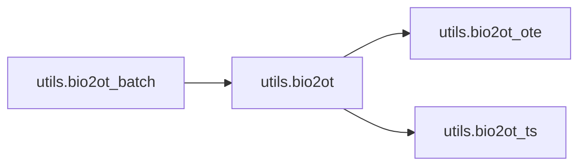

### Object Calls

* utils.bio2ot

<!---Documatic-block-utils.bio2ot_batch-start--->
<details>
	<summary><code>utils.bio2ot_batch</code> code snippet</summary>

```python
def bio2ot_batch(ote_tags, ts_tags):
    (new_ote_tags, new_ts_tags) = ([], [])
    assert len(ote_tags) == len(ts_tags)
    n_seqs = len(ote_tags)
    for i in range(n_seqs):
        (ote, ts) = bio2ot(ote_tag_sequence=ote_tags[i], ts_tag_sequence=ts_tags[i])
        new_ote_tags.append(ote)
        new_ts_tags.append(ts)
    return (new_ote_tags, new_ts_tags)
```
</details>
<!---Documatic-block-utils.bio2ot_batch-end--->
<!---Documatic-section-bio2ot_batch-end--->

# #
<!---Documatic-section-utils.bio2ot_batch-end--->

<!---Documatic-section-utils.ot2bio_batch-start--->
## utils.ot2bio_batch

<!---Documatic-section-ot2bio_batch-start--->


### Object Calls

* utils.ot2bio

<!---Documatic-block-utils.ot2bio_batch-start--->
<details>
	<summary><code>utils.ot2bio_batch</code> code snippet</summary>

```python
def ot2bio_batch(ote_tags, ts_tags):
    (new_ote_tags, new_ts_tags) = ([], [])
    assert len(ote_tags) == len(ts_tags)
    n_seqs = len(ote_tags)
    for i in range(n_seqs):
        (ote, ts) = ot2bio(ote_tag_sequence=ote_tags[i], ts_tag_sequence=ts_tags[i])
        new_ote_tags.append(ote)
        new_ts_tags.append(ts)
    return (new_ote_tags, new_ts_tags)
```
</details>
<!---Documatic-block-utils.ot2bio_batch-end--->
<!---Documatic-section-ot2bio_batch-end--->

# #
<!---Documatic-section-utils.ot2bio_batch-end--->

<!---Documatic-section-utils.read_lexicon-start--->
## utils.read_lexicon

<!---Documatic-section-read_lexicon-start--->
<!---Documatic-block-utils.read_lexicon-start--->
<details>
	<summary><code>utils.read_lexicon</code> code snippet</summary>

```python
def read_lexicon():
    path = 'mpqa_full.txt'
    sent_lexicon = {}
    with open(path) as fp:
        for line in fp:
            (word, polarity) = line.strip().split('\t')
            if word not in sent_lexicon:
                sent_lexicon[word] = polarity
    return sent_lexicon
```
</details>
<!---Documatic-block-utils.read_lexicon-end--->
<!---Documatic-section-read_lexicon-end--->

# #
<!---Documatic-section-utils.read_lexicon-end--->

[_Documentation generated by Documatic_](https://www.documatic.com)